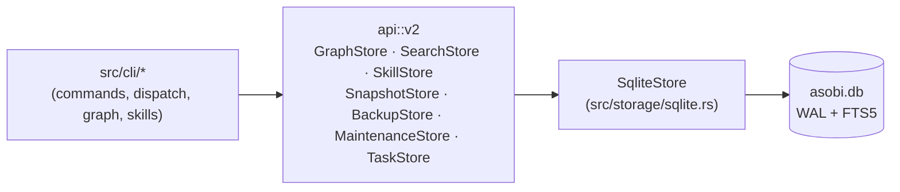

<div align="center">

# 🎮 asobi

**A persistent, project-local knowledge graph CLI for LLM agents.**

Keep memory, track session state, and share context across conversations — stored in a local, single-file SQLite database.

[](https://github.com/azusachino/asobi/actions/workflows/ci.yml) [](https://github.com/azusachino/asobi/releases) [](LICENSE) [](https://nixos.org) [](https://www.rust-lang.org)

[](https://crates.io/crates/asobi) [](https://crates.io/crates/asobi) [](https://docs.rs/asobi) [](CODE_OF_CONDUCT.md) [](CONTRIBUTING.md)

[](https://github.com/azusachino/asobi/commits/main) [](https://github.com/azusachino/asobi/stargazers)

</div>

---

## ✨ Features

- **Knowledge graph** — entities, append-only (capped) observations, and directed relations.
- **Truths** — durable `key→value` facts per entity for current state (`status`, `version`); status-as-truth makes a board a single `search --where status=…`.
- **Fast search** — `search` over SQLite FTS5 (BM25 relevance, porter stemming) with a substring fallback, plus `--where key=value` truth filters (the query term is optional).
- **Concurrency-safe** — WAL-mode storage with bounded busy timeouts, so lead and dispatched agents can share a graph.
- **Lazy reads** — `graph`/`search` return truths + counts; `show` returns the full body. Cheap to load, cheap on tokens.
- **Skills** — install reusable agent instructions from a git repo or local path.

## 🏗️ Architecture

One synchronous storage contract, one bundled backend, one local file — see [ADR 0001](docs/decisions/0001-sqlite-only-v2-rewrite.md) and [ADR 0002](docs/decisions/0002-why-rusqlite.md) for why.



Commands depend only on the `api::v2` traits, never on `rusqlite` types directly — `src/storage/sqlite.rs` is the only file that owns SQL, schema, and pragmas.

## 📦 Installation

### From crates.io (recommended)

```bash
cargo install asobi
```

### Prebuilt binary (cargo-binstall)

No compile — [`cargo-binstall`](https://github.com/cargo-bins/cargo-binstall) pulls the binary from the GitHub release:

```bash
cargo binstall asobi
```

### From source

```bash
cargo install --git https://github.com/azusachino/asobi
```

Or build locally with `make build`. Requires Rust 1.85+, Edition 2024.

## 🚀 Quick Start

```bash
asobi init                  # one-time setup (XDG); use --local for a project-scoped graph

# Store and recall context (names are hierarchical, e.g. ame:mobile-support:task-1)
asobi obs "my-project" "Decided to use WAL mode for concurrency"
asobi truth "my-project" "status" "in-progress"
asobi search "WAL"
asobi show "my-project" --with-ids
asobi update-obs "my-project" 1 "Decided to use SQLite WAL for concurrency" --id
asobi rm-obs "my-project" 1 --id

```

## 💻 Common Commands

- `asobi graph` / `search <q>` / `search --where status=READY` / `show <name>... --expand part_of --with-ids` — read the graph (supports subtree expansions and sequential observation IDs).
- `asobi new <name> <type> --obs "..."` / `obs <name> "..."` / `update-obs <name> <old/id> <new> [--id]` / `rm-obs <name> <content/id> [--id]` — manage observations (supports updates and deletions by unique sequential IDs).
- `asobi truth <name> <key> <value>` / `rm-truth <name> <key>` / `history <name> [key]` — manage truths and read their change history (overwrites are archived with valid-time; history is opt-in and never shown in `graph`/`search`/`show`).
- `asobi skills install <src> --all` / `update` / `skills` / `skills show <name>` — manage skills (`--all` and `update` sync, pruning skills dropped upstream; `--select` is additive).
- `asobi skills sync` — reconcile installed skills with the `[skills]` block in `asobi.toml`, and write each one to `.agents/skills/<source-slug>@<skill-name>/SKILL.md`.
- `asobi stats` / `purge` / `export -o graph.json` / `import graph.json` / `reset` — inspect & manage.
- `asobi backup` / `restore <snapshot> [--force]` — full-fidelity SQLite backups; see the [usage guide](docs/usage.md#backup-restore-and-portable-export).

## 🔒 Sandboxed Environments

When running in sandboxed or restricted environments (such as Codex, Nix build sandboxes, or containerized runners), use a project-local workspace (`asobi init --local`) or configure custom database paths (`ASOBI_HOME`, `ASOBI_DATABASE_URL`). The storage backend manages WAL coordination and retry behavior; legacy journal-mode and busy-timeout overrides are not supported.

See the [Running in Sandboxed Environments](docs/usage.md#running-in-sandboxed-environments-codex-etc) section in the Usage Guide for more details.

## 🛠️ Development

- **Task runner**: `make` (Nix-wrapped). `make check` is the quality gate: rustfmt, Prettier, Ruff, Clippy with `-D warnings`, Rust tests, storage-boundary checks, and CLI verification.
- **Rust quality standard**: keep code rustfmt-clean, introduce no Clippy warnings, preserve single-threaded test isolation, and add regression coverage for behavior changes. Run `make check` before commits.
- **Coverage**: with `cargo-tarpaulin` installed, run `cargo tarpaulin --out Html --output-dir coverage` and open `coverage/index.html`.
- **Benchmarks**: run `make bench`; use [performance profiling](docs/benchmarks/profiling.md) for Criterion baselines, DHAT allocations, and SQL plans.
- See [`docs/usage.md`](docs/usage.md) for the full CLI reference, [`docs/workflow.md`](docs/workflow.md) for the day-to-day and task dispatcher workflow, and [`docs/architecture.md`](docs/architecture.md) for design.
